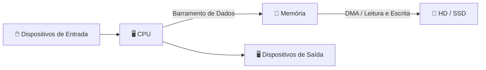
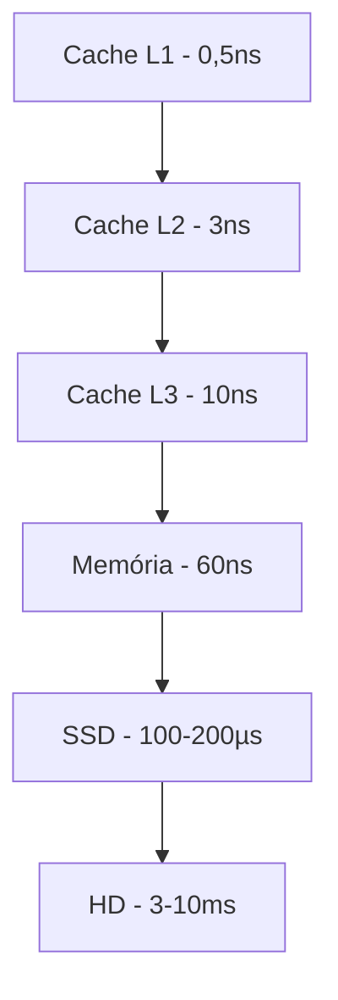
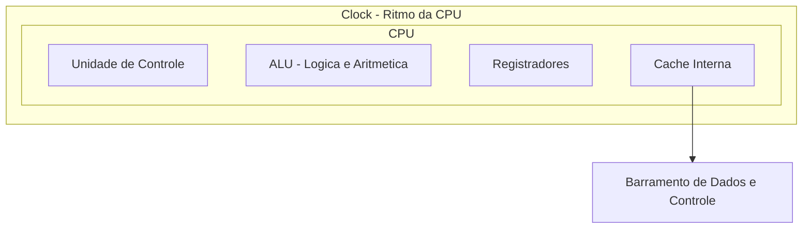

# **Introdução a Arquitetura de Computadores**

_Vamos tentar nos aprofundar nisso, sem nos afogar nisso?_

---
## **1. O que é um computador**

Um computador é uma máquina capaz de:

1. Receber dados (**entrada**).
2. Processar dados (**processamento**).
3. Entregar resultados (**saída**).

**Um resumo disso seria:**

- **Entrada** → teclado, mouse, rede, sensores.
- **Processamento (CPU)** → interpreta e executa instruções.
- **Memória** → guarda dados temporários e permanentes.
- **Saída** → monitor, som, rede, impressora.




> A mesma memória armazena tanto dados quanto instruções — isso é a base de como o hacking funciona em muitos exploits.

> Dados para disco geralmente são copiados da memória por DMA, mas controladores possuem buffers que nem sempre passam pelo cache L1/L2/L3.

> No nível mais baixo, todas as instruções que a CPU executa são compostas por combinações de 0s (zeros) e 1s (uns), representando estados elétricos (ativo/inativo)

---
## **2. Dispositivos de Entrada e Saída (I/O)**

- **Entrada**: teclado, mouse, câmera, microfone, rede.
- **Saída**: monitor, impressora, alto-falantes, rede.
- **I/O mapeado em memória**: o hardware é acessado como endereços de memória.
- **Barramentos**:
	- **USB** → periféricos.
	- **PCIe** → placas de vídeo, placas de rede, NVMe
	- **SATA** → discos.
	- **Velocidades**: teclado envia bytes em milissegundos, NVMe lê GB/s.

| Barramento      | Lanes / Interface | Taxa de Transferência | Latência Típica |
| --------------- | ----------------- | --------------------- | --------------- |
| USB 2.0         | —                 | 480 Mbps              | ~1 ms           |
| USB 3.2 Gen 1   | —                 | 5 Gbps                | ~100 µs         |
| USB 3.2 Gen 2   | —                 | 10 Gbps               | ~80 µs          |
| PCIe 3.0 x4     | 4 × 8 GT/s        | ~3 GB/s               | ~20 µs          |
| PCIe 4.0 x4     | 4 × 16 GT/s       | ~7 GB/s               | ~10–20 µs       |
| NVMe (PCIe 4.0) | PCIe 4.0 x4       | ~7 GB/s               | ~10–20 µs       |
| SATA III        | —                 | 6 Gbps (~600 MB/s)    | ~100–200 µs     |

---
## **3. Tipos de memória e armazenamento**

### Tipos:

- **Cache (L1, L2, L3)** → dentro ou perto da CPU, ultrarrápida.
- **RAM (Random Access Memory** → volátil, armazena dados temporários.
- **ROM / EPROM / Flash** → firmware.
- **HD/SSD** → armazenamento permanente.
- **Memória virtual** → Simula a memória em arquivos ou partições do disco (HD/SSD).

### Hierarquia de velocidade:

**Cache → Memória → SSD → HD** (cada nível é mais lento e maior).



>Entender essa hierarquia vai nos ajudar a explorar _timing attacks_.

---
## **4. CPU: Componentes físicos e lógicos**

Um núcleo de processamento central (CPU) reúne blocos físicos e lógicos que trabalham em conjunto para buscar, decodificar e executar instruções. Entender esses componentes é essencial para manipulação direta de registradores.

**Unidade de Controle (UC)**
- Opera o ciclo _busca-decodifica-executa_: busca instrução na memória, decodifica o opcode, envia sinais para demais unidades e escreve resultados.

 **Unidade Lógica e Aritmética (ALU)**
- Realiza operações matemáticas (adição, subtração) e lógicas (AND, OR, XOR, shifts, comparações).

**Registradores**
Conjunto de registradores internos super-rápidos (32 bits em x86):
- EAX, EBX, ECX, EDX (uso geral e retornos de função)
- ESI, EDI (origem e destino em cópias de memória)
- EBP, ESP (gerenciamento de _stack frames_)
- EIP (ponteiro de próxima instrução)
- EFLAGS (bandeiras de status e controle)

>  Alterar EIP desvia o fluxo de execução causando [overflows](#buffers-e-overflows-transbordamento) e forjar EAX muda valores de retorno.

**Cache Interna**
- Níveis L1, L2, L3 interligados diretamente à ALU e registradores para minimizar latência.

**Clock**
- Marca o ritmo de todas as etapas (MHz/GHz); overclocking impacta desempenho e segurança.

 **Barramentos**
 - Linhas de controle, endereços e dados que conectam CPU, memória e I/O (Front-Side Bus, QPI/UPI, AXI, etc.).

**Threads e Instruções**
- **Threads** alternam contextos de registradores e EIP/EFLAGS, permitindo multitarefa e expondo vetores de ataque em _context switch_.
- **Pipeline** e execução fora de ordem introduzem pontos de contensão exploráveis em [Spectre e Meltdown](#spectre--meltdown).

### Diagrama de layout da CPU



---
## **5. Heap, Stack e Buffers**

O espaço ou tipo de memória de um programa costuma ser dividido em regiões bem definidas, cada uma com propósito e comportamento diferentes. Buffers são apenas blocos de bytes — eles podem viver tanto na stack quanto na heap e, quando mal geridos, permitem invasões que corrompem ou manipulam dados e instruções.

### Visão Geral

**Code**  
- Contém as instruções executáveis do programa.
**Data**  
- Variáveis globais e estáticas inicializadas ou não inicializadas
**Stack**  
- Pilha de chamadas: armazena variáveis locais e endereços de retorno. **Cresce para baixo.**
**Heap**  
- Espaço de alocação dinâmica (via `malloc`/`free`), controlada pelo programador. **Cresce para cima.**
**Buffers**  
- Blocos de memória (arrays, cadeias de caracteres, etc.) usados para agrupar dados temporários. Podem existir tanto na stack (buffers locais) quanto na heap (buffers dinâmicos).

> Em alguns sistemas, heap pode crescer “para baixo” ou ser gerenciado por [Top-of-Heap](#top-of-heap-topo-da-memória-heap), não há padronização absoluta.

###  Layout geral da memória:

**Stack**
- Cada chamada de função cria um _stack frame_, pelo compilador/interpretador.
- Guarda variáveis locais e o endereço de retorno.
- Cresce em direção às regiões de heap/data.

>_Stack overflow_ ocorre quando um buffer local extrapola o tamanho reservado e sobrescreve dados vizinhos (por exemplo, o endereço de retorno).

**Heap**
- Blocos alocados em tempo de execução com `malloc` e liberados com `free`.
- Metadata (tamanho, ponteiros internos) fica armazenada antes ou depois de cada bloco.
- Cresce em direção ao espaço livre acima de data segment.

> [Heap Overflow](#buffers-e-overflows-transbordamento) e [Use After Free](#use-after-free) permitem corromper essa metadata, levando à execução de código arbitrário via [Hijacking](#hijacking-sequestro-de-controle) de ponteiros.

```
endereço alto          [0xFFFFFFFF]
┌───────────────────┐
│ Stack (cresce ↓)  │ 
├───────────────────┤
|   MEMÓRIA LIVRE   │
├───────────────────┤
│ Heap (cresce ↑)   │
├───────────────────┤
│ .bss              | <- Dados não inicializados
│ .data             │ <- Dados inicializados
│ .text             │ <- Código (texto executável)
└───────────────────┘
endereço baixo         [0x00000000] 
```

> Por convenção, expressamos esses endereços em números base 16 (hexadecimal). Por exemplo, o menor endereço possível é `0x00000000`(onde o 0x significa base 16), e o maior endereço possível poderia ser `0xFFFFFFFF`- A .

> **Referência**: [Stack and Heap Memory](https://courses.grainger.illinois.edu/cs225/fa2022/resources/stack-heap/) - veremos muito mais sobre memória quando falarmos de programas e algoritmos, até lá isso já é o suficiente, mas se estiver ansioso pode ler esse artigo aqui.

## **6. Glossário**

### Spectre / Meltdown
 São vulnerabilidades de microarquitetura que exploram a execução especulativa da CPU para vazar dados sensíveis via canais laterais de cache.
 
- Spectre: faz a CPU “chutar” caminhos de código inválidos em outros processos e, usando medições de tempo de cache, extrai segredos.
- Meltdown: rompe o isolamento entre modo usuário e kernel, lendo memória protegida antes de a verificação de permissão ocorrer
### Buffers e Overflows (transbordamento)
- Buffers são regiões contínuas de memória para armazenar dados de entrada/saída temporários.
- Quando dados ultrapassam o espaço reservado, ocorrem **overflows**, que sobrescrevem valores adjacentes (variáveis, ponteiros, endereços de retorno).
### Use-After-Free
- Bug onde um programa continua acessando memória após ela ter sido liberada (`free()`/`delete`). Pode levar a corrupção de dados, crashes ou execução remota de código, já que a pessoa invasora pode realocar aquele bloco liberado com o payload que ela quiser.
### Hijacking (sequestro de controle)
- Técnica de sobrescrever ponteiros de função, endereços de retorno (EIP/RIP) ou tabelas de vetores de interrupção para redirecionar o fluxo de execução para código malicioso.
### Top-of-Heap (topo da memória heap)
- Ponteiro interno que marca o limite superior do heap livre, ajustá-lo define para onde novos blocos serão alocados. Controlar o topo do heap é um truque comum em heap feng shui, uma técnica usada em exploits para facilitar a execução de código arbitrário.

---
## **7. O que isso tem a ver com Hacking?**

- **Firmware** (ROM/Flash) podem ser reescritos para persistência;
- **Ataques DMA** → acesso físico à memória;
- **Manipulação de registradores** para desviar execução;
- **Buffer overflows** para injetar código;

